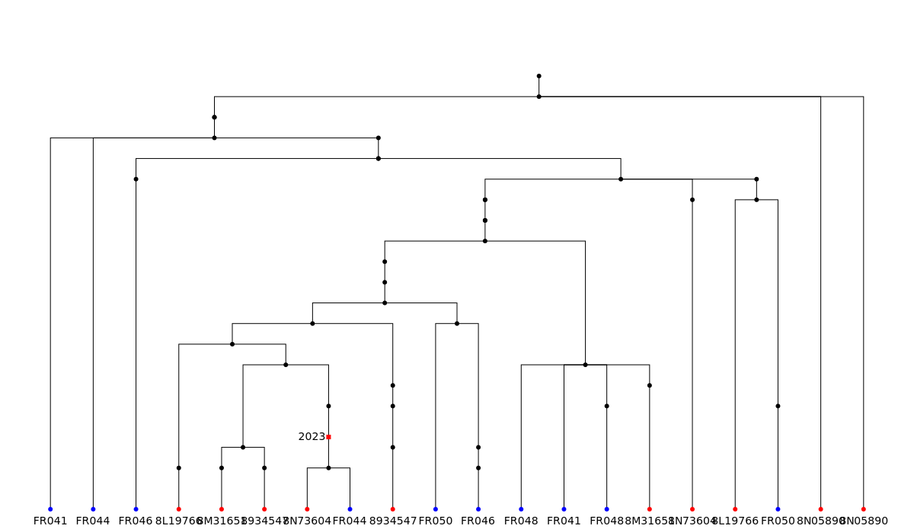

.. _sec_tutorial:

=======================
Tutorial
=======================

***********
Toy example
***********

Suppose that we have observed the following data::

    sample  haplotype
    0       AGCGAT
    1       TGACAG
    2       AGACAC
    3       ACCGCT
    4       ACCGCT

Here we have phased haplotype data for five samples at six sites. We wish to infer the
genealogies that gave rise to this data set. To import the data into ``tsinfer`` we must
know the *ancestral state* for each site we wish to use for inference; there are many
methods for achieving this: details are outside the scope of this manual, but we have
started a `discussion topic <https://github.com/tskit-dev/tsinfer/discussions/523>`_ on
this issue to provide some recommendations. Assuming that we
know the ancestral state, we can then import our data into a ``tsinfer``
:ref:`Sample data<sec_file_formats_samples>` file using the Python
:ref:`API<sec_api_file_formats>`:

.. code-block:: python

    import tsinfer

    with tsinfer.SampleData(sequence_length=6) as sample_data:
        sample_data.add_site(0, [0, 1, 0, 0, 0], ["A", "T"])
        sample_data.add_site(1, [0, 0, 0, 1, 1], ["G", "C"])
        sample_data.add_site(2, [0, 1, 1, 0, 0], ["C", "A"])
        sample_data.add_site(3, [0, 1, 1, 0, 0], ["G", "C"])
        sample_data.add_site(4, [0, 0, 0, 1, 1], ["A", "C"])
        sample_data.add_site(5, [0, 1, 2, 0, 0], ["T", "G", "C"])

Here we create a new :class:`.SampleData` object for five samples. We then
sequentially add the data for each site one-by-one using the
:meth:`.SampleData.add_site` method. The first argument for ``add_site`` is the
position of the site in genome coordinates. This can be any positive value
(even floating point), but site positions must be unique and sites must be
added in increasing order of position. For convenience we've given the sites
position 0 to 5 here, but they could be any values. The second argument for
``add_site`` is a list of *genotypes* for the site. Each value in a genotypes
array ``g`` is an integer, giving an index into the list provided as the third
argument to ``add_site``: the list of *alleles* for this site. The initial element
in each list of alleles is assumed to be the ancestral state (so that a zero in
the genotypes list always indicates an ancestral variant). Each call to ``add_site``
thus stores a single column of the original haplotype data above. For example,
the ancestral and derived states for the site at position 0 are "A" and "T" and the
genotypes are 01000: this encodes the first column, ATAAA. Note that not all sites
are used for inference: this includes fixed sites, singletons (in this example, the
site at position 0) and sites with more than 2 alleles (e.g. the site at position 5);
it is also possible to mark explicitly a site as not-for-inference when calling
``add_site``, e.g. if the ancestral state designated for the site is questionable.

Once we have stored our data in a :class:`.SampleData` object, we can easily infer 
a :ref:`tree sequence<sec_python_api_trees_and_tree_sequences>` using the Python
API:

.. code-block:: python

    inferred_ts = tsinfer.infer(sample_data)

And that's it: we now have a fully functional :class:`tskit.TreeSequence`
object that we can interrogate in the usual ways. For example, we can look
at the inferred topology and the stored haplotypes:

.. code-block:: python

    for tree in inferred_ts.trees():
        print(tree.draw(format="unicode"))
    for sample_id, h in enumerate(inferred_ts.haplotypes()):
        print(sample_id, h, sep="\t")

Which gives us the output::

        7
    ┏━━┳┻━━┓
    ┃  5   6
    ┃ ┏┻┓ ┏┻┓
    0 3 4 1 2

    0	AGCGAT
    1	TGACAG
    2	AGACAC
    3	ACCGCT
    4	ACCGCT

You will notice that the inferred tree contains a *polytomy* at the root. This is a
common feature of trees inferred by ``tsinfer`` and signals that there was not
sufficient information to resolve the tree at this node.

Each internal (non-sample) node in this inferred tree represents an ancestral sequence,
constructed on the basis of shared, derived alleles at one or more of the sites. By
default, the time of each such node is *not* measured in years or generations, but
is simply the frequency of the shared derived allele(s) on which the ancestral sequence
is based. To add meaningful dates to an inferred tree sequence you must use additional
software such as ``tsdate``: the ``tsinfer`` algorithm is only intended to infer the
genetic relationships between the samples (i.e. the *topology* of the tree sequence).

Note that the sample sequences generated by this tree sequence are identical to the
input haplotype data: apart from the imputation of
:ref:`missing data<sec_inference_data_requirements>`, ``tsinfer`` is guaranteed to
losslessly encode any given input data, regardless of the inferred topology.

******************
Simulation example
******************

The previous example showed how we can infer a tree sequence using the Python API for a trivial
toy example. However, for real data we will not prepare our data and infer the tree sequence all
in one go; rather, we will usually split the process into at least two distinct steps.

The first step in any inference is to prepare your data and import it into a :ref:`sample data
<sec_file_formats_samples>` file. For simplicity here we'll use Python to simulate some
data under the coalescent with recombination, using `msprime
<https://msprime.readthedocs.io/en/stable/api.html#msprime.simulate>`_:

.. code-block:: python

    import tqdm
    import msprime
    import tsinfer

    ts = msprime.simulate(
        sample_size=10000,
        Ne=10**4,
        recombination_rate=1e-8,
        mutation_rate=1e-8,
        length=10 * 10**6,
        random_seed=42,
    )
    ts.dump("simulation-source.trees")
    print("simulation done:", ts.num_trees, "trees and", ts.num_sites, "sites")

    progress = tqdm.tqdm(total=ts.num_sites)
    with tsinfer.SampleData(
        path="simulation.samples", sequence_length=ts.sequence_length, num_flush_threads=2
    ) as sample_data:
        for var in ts.variants():
            sample_data.add_site(var.site.position, var.genotypes, var.alleles)
            progress.update()
        progress.close()

Running the code we get::

    $ python3 simulation-example.py
    Simulation done: 36734 trees and 39001 sites
    100%|████████████████████████████████| 39001/39001 [00:51<00:00, 762.26it/s]

In this script we first run a simulation of a sample of 10 thousand 10 megabase chromosomes with
human-like parameters, which results in about 37K distinct trees and 39K segregating sites. We
then create a :class:`.SampleData` instance to store the data we have simulated as before, but
providing a few more parameters in this case. Firstly, we pass a ``path`` argument to provide a
filename in which to permanently store the information. We also provide a ``sequence_length``
argument (which defines the overall coordinate space for site positions) so that this value can
be recovered in the final tree sequence that we output later. Finally, we set
``num_flush_threads=2``, which tells ``tsinfer`` to use two background threads for compressing
data and flushing it to disk.

To allow us to keep track of how this process of compressing and storing the sample data is
progressing, the code above also sets up a progress meter using
`tqdm <https://github.com/tqdm/tqdm>`_. The script output above shows the state of the
progress meter at the end of this process, and shows that it took about 50 seconds to
import the data for this simulation into ``tsinfer``'s sample data format.

.. note::
    If you already have a tree sequence file, and wish to create a sample data file from
    it, a shortcut is to use the :meth:`tsinfer.SampleData.from_tree_sequence` method. In
    this case you do not need to specify the sequence length, and you probably want to
    specify ``use_times=False``. For example, the following snippet is equivalent to the
    data file creation part of the code above::

        tsinfer.SampleData.from_tree_sequence(
            ts, path="simulation.samples", num_flush_threads=2, use_times=False)

Examining the files on the command line, we then see the following::

    $ ls -lh simulation*
    -rw-r--r-- 1 jk jk  22M May 12 11:06 simulation.samples
    -rw-r--r-- 1 jk jk 4.8M May 12 11:06 simulation-source.trees

The ``simulation.samples`` file is quite small, being only about four times the size of the
original ``msprime`` tree sequence file. The :ref:`tsinfer command line interface <sec_cli>`
provides a useful way to examine files in more detail using the ``list`` (or ``ls``) command::

    $ tsinfer ls simulate.samples
    path                  = simulation.samples
    file_size             = 21.8 MiB
    format_name           = tsinfer-sample-data
    format_version        = (1, 0)
    finalised             = True
    uuid                  = ab667d05-06bc-4a15-ab85-ab5a0ac39c36
    num_provenances       = 1
    provenances/timestamp = shape=(1,); dtype=object;
    provenances/record    = shape=(1,); dtype=object;
    sequence_length       = 10000000.0
    num_populations       = 0
    num_individuals       = 10000
    num_samples           = 10000
    num_sites             = 39001
    num_inference_sites   = 35166
    populations/metadata  = shape=(0,); dtype=object;
    individuals/metadata  = shape=(10000,); dtype=object;
    individuals/location  = shape=(10000,); dtype=object;
    samples/individual    = shape=(10000,); dtype=int32;uncompressed size=40.0 kB
    samples/population    = shape=(10000,); dtype=int32;uncompressed size=40.0 kB
    samples/metadata      = shape=(10000,); dtype=object;
    sites/position        = shape=(39001,); dtype=float64;uncompressed size=312.0 kB
    sites/alleles         = shape=(39001,); dtype=object;
    sites/inference       = shape=(39001,); dtype=uint8;uncompressed size=39.0 kB
    sites/genotypes       = shape=(39001, 10000); dtype=uint8;uncompressed size=390.0 MB
    sites/metadata        = shape=(39001,); dtype=object;

Most of this output is not particularly interesting here, but we can see that the
``sites/genotypes`` array which holds all of the sample genotypes (and thus the vast bulk of the
actual data) requires about 390MB uncompressed. The ``tsinfer`` sample data format is therefore
achieving a roughly 20X compression in this case. In practise this means we can keep such files
lying around without taking up too much space.

Once we have our ``.samples`` file created, running the inference is straightforward.
We can do so within Python (as we did in the toy example above), or use ``tsinfer`` on
the command-line, which is useful when inference is expected to take a long time::

    $ tsinfer infer simulation.samples -p -t 4
    ga-add   (1/6): 100%|███████████████████████| 35.2K/35.2K [00:02, 15.3Kit/s]
    ga-gen   (2/6): 100%|███████████████████████| 26.5K/26.5K [00:30,   862it/s]
    ma-match (3/6): 100%|██████████████████████▉| 26.5K/26.5K [01:02,   160it/s]
    ms-match (4/6): 100%|███████████████████████| 10.0K/10.0K [02:27,  67.9it/s]
    ms-paths (5/6): 100%|███████████████████████| 10.0K/10.0K [00:00, 26.0Kit/s]
    ms-sites (6/6): 100%|███████████████████████| 39.0K/39.0K [00:02, 15.5Kit/s]

Running the ``infer`` command runs the full inference pipeline in one go (the individual steps
are explained :ref:`here <sec_inference>`), writing the output, by default, to the tree sequence
file ``simulation.trees``. We provided two extra arguments to ``infer``: the ``-p`` flag
(``--progress``) gives us the progress bars show above, and ``-t 4`` (``--num-threads=4``) tells
``tsinfer`` to use four worker threads whenever it can use them.

This inference was run on a Core i3-530 processor (launched 2010) with 4GiB of RAM, and took
about four minutes. The maximum memory usage was about 600MiB.

Looking at our output files, we see::

    $ ls -lh simulation*
    -rw-r--r-- 1 jk jk  22M May 12 11:06 simulation.samples
    -rw-r--r-- 1 jk jk 4.8M May 12 11:06 simulation-source.trees
    -rw-r--r-- 1 jk jk 4.4M May 12 11:27 simulation.trees

Therefore our output tree sequence file that we have just inferred in less than five minutes is
*even smaller* than the original ``msprime`` simulated tree sequence! Because the output file is
also a :class:`tskit.TreeSequence`, we can use the same API to work with both, for example,
within Python we can do:

.. code-block:: python

    import tskit

    source = tskit.load("simulation-source.trees")
    inferred = tskit.load("simulation.trees")

    subset = range(0, 6)
    source_subset = source.simplify(subset)
    inferred_subset = inferred.simplify(subset)

    tree = source_subset.first()
    print("True tree: interval=", tree.interval)
    print(tree.draw(format="unicode"))

    tree = inferred_subset.first()
    print("Inferred tree: interval=", tree.interval)
    print(tree.draw(format="unicode"))

This first loads up our source and inferred tree sequences from their corresponding
``.trees`` files. Each of the trees in these tree sequences has 10 thousand samples
which is much too large to easily visualise. Therefore, to make things simple here
we subset both tree sequences down to their minimal representations for six
samples using :meth:`tskit.TreeSequence.simplify`.
(Using this tiny subset of the overall data allows us to get an informal
feel for the trees that are inferred by ``tsinfer``, but this is certainly
not a recommended approach for validating the inference!)

Once we've subsetted the tree sequences down to something that we can
comfortably look at, we then get the **first** tree from each tree sequence
and print it out. Note again that we are looking at only the first tree here;
there will be thousands more trees in each sequence. The output we get is::

    True tree: interval= (0.0, 488.1131463889296)
        4546
     ┏━━┻━┓
     ┃    900
     ┃  ┏━┻━┓
     ┃  ┃   854
     ┃  ┃ ┏━┻┓
     309┃ ┃  ┃
    ┏┻┓ ┃ ┃  ┃
    ┃ ┃ ┃ ┃  41
    ┃ ┃ ┃ ┃ ┏┻┓
    0 1 2 3 4 5

    Inferred tree: interval= (0.0, 6176.988890134446)
       2386      
     ┏━┳┻━━┓    
     ┃ ┃ 1697   
     ┃ ┃ ┏━╋━━┓ 
     ┃ ┃ ┃ ┃ 480
     ┃ ┃ ┃ ┃ ┏┻┓
     0 1 2 3 4 5

There are a number of things to note about these two trees. Firstly, it
is important to note that the intervals over which these trees apply are
quite different: the true tree covers the interval up to coordinate
488, but the inferred tree covers a much longer interval, up to 6176.
Our inference depends on the mutational information that is present.
If no mutations fall on a particular edge in the tree sequence, then
we have no way of inferring that this edge existed. As a result, there
will be tree transitions that we cannot pick up. In the simulation that we
performed the mutation rate is equal to the recombination rate, and so
we expect that many recombinations will be invisible to us in the
output data.

For similar reasons, there will be many nodes in the tree at which
polytomies occur. Here we correctly infer that 4 and 5 coalesce
first and that 4 is a sibling of this node. However, we were not
able to distinguish the order in which 2 and 3 coalesced with
the ancestors of 4 and 5, and so we have three children of node 2290
in the inferred tree. (Note that, other than the samples, there is
no correspondence between the node IDs in the source tree and the
inferred tree.)

The final point to make here is that there will be incorrect inferences in some
trees. In this example we incorrectly inferred that 0 coalesces with the
ancestor of nodes 2, 3, 4 and 5 before 1.

************
Data example
************

Inputting real data for inference is similar in principle to the examples above:
you simply iterate over the sites in your data file, calling :meth:`.SampleData.add_site`
for each variable site. We do not provide methods to read directly from other formats, as
these formats are often too complex for automatic conversion. However, many Python
libraries are available for reading different genomic data formats, and writing a script
to iterate over the sites in such files is usually a fairly simple task. The example
below shows how this can be done for a VCF file, using a freely available VCF reading
library.

+++++++++++++
Reading a VCF
+++++++++++++

A common way to store genetic variation data is as a VCF (Variant Call Format) file.
The `CYVCF2 library <https://github.com/brentp/cyvcf2>`_ provides a relatively fast
Python interface for reading VCF files. The following script demonstrates how to infer a
tree sequence from a simple VCF file. In particular the function below named
``add_diploid_sites`` illustrates how to iterate over the variants in a ``CYVCF2.VCF``
object and add them to a ``tsinfer`` sample data file. This particular script assumes
that the VCF describes a set of phased, diploid individuals, and has the ancestral state
present in the INFO field of the VCF (otherwise it takes the reference allele as the
ancestral state). For example data, we use a publicly available VCF file of the genetic
variants from chromosome 24 of ten Norwegian and French house sparrows,
*Passer domesticus* (thanks to Mark Ravinet for the data file):

.. code-block:: python

    import cyvcf2
    import tsinfer

    def add_diploid_sites(vcf, samples):
        """
        Read the sites in the vcf and add them to the samples object, reordering the
        alleles to put the ancestral allele first, if it is available.
        """
        pos = 0
        for variant in vcf:  # Loop over variants, each assumed at a unique site
            if pos == variant.POS:
                raise ValueError("Duplicate positions for variant at position", pos)
            else:
                pos = variant.POS
            if any([not phased for _, _, phased in variant.genotypes]):
                raise ValueError("Unphased genotypes for variant at position", pos)
            alleles = [variant.REF] + variant.ALT
            ancestral = variant.INFO.get("AA", variant.REF)
            # Ancestral state must be first in the allele list.
            ordered_alleles = [ancestral] + list(set(alleles) - {ancestral})
            allele_index = {
                old_index: ordered_alleles.index(allele)
                for old_index, allele in enumerate(alleles)
            }
            # Map original allele indexes to their indexes in the new alleles list.
            genotypes = [
                allele_index[old_index]
                for row in variant.genotypes
                for old_index in row[0:2]
            ]
            samples.add_site(pos, genotypes=genotypes, alleles=ordered_alleles)

    def chromosome_length(vcf):
        assert len(vcf.seqlens) == 1
        return vcf.seqlens[0]

    # URL for the VCF
    url = "https://github.com/tskit-dev/tsinfer/raw/main/docs/_static/P_dom_chr24_phased.vcf.gz"

    vcf = cyvcf2.VCF(url)
    with tsinfer.SampleData(
        path="P_dom_chr24_phased.samples", sequence_length=chromosome_length(vcf)
    ) as samples:
        add_diploid_sites(vcf, samples)

    print(
        "Sample file created for {} samples ".format(samples.num_samples)
        + "({} individuals) ".format(samples.num_individuals)
        + "with {} variable sites.".format(samples.num_sites),
        flush=True,
    )

    # Do the inference
    ts = tsinfer.infer(samples)
    print(
        "Inferred tree sequence: {} trees over {} Mb ({} edges)".format(
            ts.num_trees, ts.sequence_length / 1e6, ts.num_edges
        )
    )

On a modern computer, this should only take a few seconds to run, producing this output::

    Sample file created for 20 samples (20 individuals) with 13192 variable sites.
    Inferred tree sequence: 6666 trees (32824 edges)

.. note::
    Larger VCF files will take some time to parse, and you may wish to add some sort of
    progress indicator to this script, for example by inserting the line
    ``progressbar = tqdm.tqdm(total=samples.sequence_length, desc="Read VCF", unit='bp')``
    at the top of the ``add_diploid_sites`` function, followed by
    ``progressbar.update(variant.POS - pos)`` as the first line of the variant loop within
    that function.

+++++++++++++++++++++++
Adding more information
+++++++++++++++++++++++

As the output indicates, we have created 20 individuals, each with a single chromosome,
rather than (as we probably intended) 10 individuals each with 2 chromosomes. That's
because the script has not called :meth:`.SampleData.add_individual`, so
``tsinfer`` has assumed that each input chromosome belongs to a single (haploid)
:ref:`individual <sec_inference_data_model_individual>`. Although this is perfectly
OK and does not invalidate further analysis, it may be difficult to match information
from the original VCF file with nodes in the tree sequence. Ideally, you should aim to
incorporate all necessary information into the sample data file, from where it will be
carried through into the final inferred tree sequence. The code below demonstrates not
only how to associate each pair of samples with a diploid individual, but also how to
allocate an identifier to these individuals by using the individual's metadata field.
The code also gives a basic illustration of adding extra information about the
:ref:`population<sec_inference_data_model_population>` from which each individual has
been sampled.

.. code-block:: python

    import json

    def add_populations(vcf, samples):
        """
        Add tsinfer Population objects and returns a list of IDs corresponding to the VCF samples.
        """
        # In this VCF, the first letter of the sample name refers to the population
        samples_first_letter = [sample_name[0] for sample_name in vcf.samples]
        pop_lookup = {}
        pop_lookup["8"] = samples.add_population(metadata={"country": "Norway"})
        pop_lookup["F"] = samples.add_population(metadata={"country": "France"})
        return [pop_lookup[first_letter] for first_letter in samples_first_letter]

    def add_diploid_individuals(vcf, samples, populations):
        for name, population in zip(vcf.samples, populations):
            samples.add_individual(ploidy=2, metadata={"name": name}, population=population)

    # Repeat as previously but add both populations and individuals
    vcf = cyvcf2.VCF(url)
    with tsinfer.SampleData(
        path="P_dom_chr24_phased.samples", sequence_length=chromosome_length(vcf)
    ) as samples:
        populations = add_populations(vcf, samples)
        add_diploid_individuals(vcf, samples, populations)
        add_diploid_sites(vcf, samples)

    print(
        "Sample file created for {} samples ".format(samples.num_samples)
        + "({} individuals) ".format(samples.num_individuals)
        + "with {} variable sites.".format(samples.num_sites),
        flush=True,
    )

    # Do the inference
    sparrow_ts = tsinfer.infer(samples)
    print(
        "Inferred tree sequence `{}`: {} trees over {} Mb".format(
            "sparrow_ts", sparrow_ts.num_trees, sparrow_ts.sequence_length / 1e6
        )
    )
    # Check the metadata
    for sample_node_id in sparrow_ts.samples():
        individual_id = sparrow_ts.node(sample_node_id).individual
        population_id = sparrow_ts.node(sample_node_id).population
        print(
            "Node",
            sample_node_id,
            "labels one chromosome 24 sampled from individual",
            json.loads(sparrow_ts.individual(individual_id).metadata),
            "in",
            json.loads(sparrow_ts.population(population_id).metadata)["country"],
        )

Which results in the correct output::

    Sample file created for 20 samples (10 individuals) with 13192 variable sites.
    Inferred tree sequence `sparrow_ts`: 6666 trees over 7.067267 Mb
    Node 0 labels one chromosome 24 sampled from individual {'name': '8934547'} in Norway
    Node 1 labels one chromosome 24 sampled from individual {'name': '8934547'} in Norway
    Node 2 labels one chromosome 24 sampled from individual {'name': '8L19766'} in Norway
    ...

+++++++++++
Analysis
+++++++++++

To analyse your inferred tree sequence you can use all the analysis functions built in to
the `tskit <//tskit.readthedocs.io/>`_ library. The
:ref:`tskit tutorial<sec_tutorial_stats>` provides much more detail. Below we just give a
flavour of the possibilities.

To quickly eyeball small datasets, we can draw the entire tree sequence, or
:meth:`draw<tskit.Tree.draw>` the tree at any particular genomic position. The following
code demonstrates how to use the :meth:`tskit.TreeSequence.at` method to obtain the tree
1Mb from the start of the sequence, and plot it, colouring the tips according to
population:

.. code-block:: python

    colours = {"Norway": "red", "France": "blue"}
    colours_for_node = {}
    for n in sparrow_ts.samples():
        population_data = sparrow_ts.population(sparrow_ts.node(n).population)
        colours_for_node[n] = colours[json.loads(population_data.metadata)["country"]]

    individual_for_node = {}
    for n in sparrow_ts.samples():
        individual_data = sparrow_ts.individual(sparrow_ts.node(n).individual)
        individual_for_node[n] = json.loads(individual_data.metadata)["name"]

    tree = sparrow_ts.at(1e6)
    tree.draw(
        path="tree_at_1Mb.svg",
        height=700,
        width=1200,
        node_labels=individual_for_node,
        node_colours=colours_for_node,
    )

This tree seems to suggest that Norwegian and French individuals may not fall into
discrete groups on the tree, but be part of a larger mixing population. Note, however,
that this is only one of thousands of trees, and may not be typical of the genome as a
whole. Additionally, most data sets will have far more samples than this example, so
trees visualized in this way are likely to be huge and difficult to understand. It is
possible to plot a subset of the tips by :meth:`simplifying<tskit.TreeSequence.simplify>`
the tree sequence to a limited number of samples, but it is likely that most studies will
instead rely on various statistical summaries of the trees. Storing genetic data as a
tree sequence makes many of these calculations fast and efficient, and tskit has both a
set of :ref:`commonly used methods<sec_stats>` and a framework that
:ref:`generalizes population genetic statistics<sec_stats_general_api>`. For example,
the allele or site frequency spectrum (SFS) can be calculated using
:meth:`tskit.TreeSequence.allele_frequency_spectrum` and the allelic diversity ("Tajima's
:math:`{\pi}`") using :meth:`tskit.TreeSequence.diversity`, both of which can also be
calculated locally (e.g. :ref:`per tree or in genomic windows <sec_stats_windows>`). As
a basic example, here's how to calculate genome-wide :math:`F_{st}` between the Norwegian
and French (sub)populations:

.. code-block:: python

    samples_listed_by_population = [
        sparrow_ts.samples(population=pop_id)
        for pop_id in range(sparrow_ts.num_populations)
    ]

    Fst = sparrow_ts.Fst(samples_listed_by_population)
    print(Fst)

And following this, here is how to calculate the genealogical nearest neighbour (GNN)
proportions, using the individual and population metadata to format the results table in
a tidy manner

.. code-block:: python

    import pandas as pd

    gnn = sparrow_ts.genealogical_nearest_neighbours(
        sparrow_ts.samples(), samples_listed_by_population
    )

    # Tabulate GNN nicely using a Pandas dataframe with named rows and columns
    sample_nodes = [sparrow_ts.node(n) for n in sparrow_ts.samples()]
    sample_ids = [n.id for n in sample_nodes]
    sample_names = [
        json.loads(sparrow_ts.individual(n.individual).metadata)["name"]
        for n in sample_nodes
    ]
    sample_pops = [
        json.loads(sparrow_ts.population(n.population).metadata)["country"]
        for n in sample_nodes
    ]
    gnn_table = pd.DataFrame(
        data=gnn,
        index=[
            pd.Index(sample_ids, name="Sample node"),
            pd.Index(sample_names, name="Bird"),
            pd.Index(sample_pops, name="Country"),
        ],
        columns=[json.loads(p.metadata)["country"] for p in sparrow_ts.populations()],
    )

    print(gnn_table)
    # Summarize GNN for all birds from the same country
    print(gnn_table.groupby(level="Country").mean())

giving::

                                   Norway    France
    Sample node Bird    Country                    
    0           8934547 Norway   0.556627  0.443373
    1           8934547 Norway   0.512883  0.487117
    2           8L19766 Norway   0.492479  0.507521
    3           8L19766 Norway   0.479670  0.520330
    4           8M31651 Norway   0.540306  0.459694
    5           8M31651 Norway   0.586742  0.413258
    6           8N05890 Norway   0.545757  0.454243
    7           8N05890 Norway   0.551132  0.448868
    8           8N73604 Norway   0.531846  0.468154
    9           8N73604 Norway   0.528082  0.471918
    10          FR041   France   0.452105  0.547895
    11          FR041   France   0.457217  0.542783
    12          FR044   France   0.484194  0.515806
    13          FR044   France   0.421929  0.578071
    14          FR046   France   0.537646  0.462354
    15          FR046   France   0.493566  0.506434
    16          FR048   France   0.482920  0.517080
    17          FR048   France   0.475115  0.524885
    18          FR050   France   0.510829  0.489171
    19          FR050   France   0.491866  0.508134

               Norway    France
    Country                    
    France   0.480739  0.519261
    Norway   0.532552  0.467448

From this, it can be seen that the genealogical nearest neighbours of birds in Norway
tend also to be in Norway, and vice versa for birds from France. In other words, there is
a small but noticable degree of population structure in the data. The bird ``8L19766``
and one of the chromosomes of bird ``FR046`` seem to buck this trend, and it would
probably be worth checking these data points further (perhaps they are migrant birds),
and verifying if other chromosomes in these individuals show the same pattern.

Much more can be done with the genomic statistics built into tskit. For further
information, please refer to the :ref:`statistics section<sec_stats>` of the
tskit documentation.
